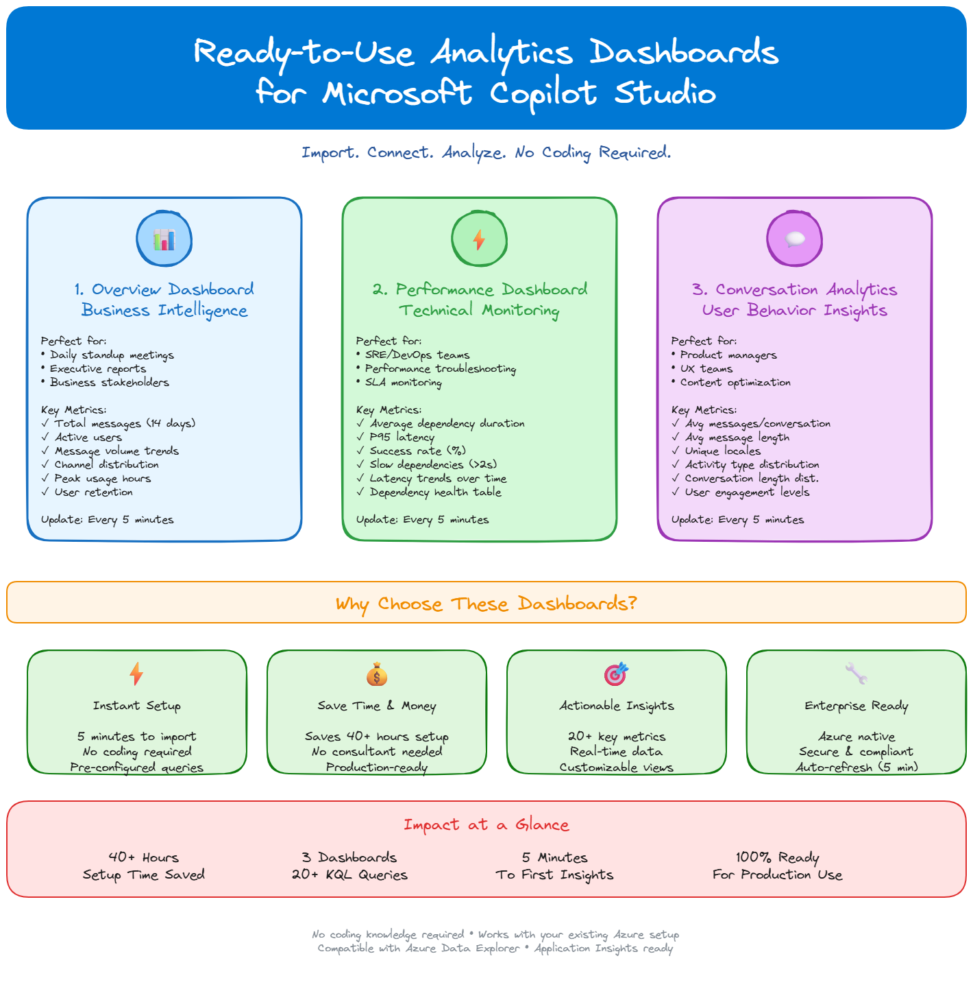

# Copilot Studio Advanced Analytics



A comprehensive collection of **production-ready KQL queries** and **Azure Data Explorer dashboards** for monitoring and analyzing **Microsoft Copilot Studio** agents through Azure Application Insights telemetry.

[](https://opensource.org/licenses/MIT)
[](https://docs.microsoft.com/en-us/azure/data-explorer/kusto/query/)
[](https://www.microsoft.com/en-us/microsoft-copilot/microsoft-copilot-studio)

## 🎯 Overview

This repository provides a complete observability solution for Copilot Studio agents, enabling teams to:

- **Monitor Usage**: Track bot adoption, active users, conversation sessions, and channel distribution
- **Measure Performance**: Analyze response latency, throughput, and identify bottlenecks
- **Assess Quality**: Evaluate conversation success rates, error patterns, and user satisfaction
- **Optimize Operations**: Detect anomalies, set up production alerts, and improve agent effectiveness
- **Understand Users**: Analyze engagement patterns, message flows, and user behavior

All queries work with the actual Copilot Studio telemetry schema using `customEvents` and `customDimensions` in Azure Application Insights.

## 📁 Repository Structure

```
copilotadvandcedanalytics/
├── CopilotStudio-KQL/          # Main KQL query collection
│   ├── 01-Usage-Metrics/       # Bot adoption and user activity queries
│   ├── 02-Performance-Metrics/ # Response time and latency analysis
│   ├── 03-Quality-Metrics/     # Conversation quality evaluation
│   ├── 04-Agent-Evaluation/    # Bot performance assessment
│   ├── 05-Dependencies/        # External API monitoring
│   ├── 06-Advanced-Analytics/  # Conversation flows and patterns
│   ├── 07-Alerts/              # Production-ready alert queries
│   ├── Dashboards/             # Azure Data Explorer dashboards
│   └── Docs/                   # Documentation and guides
├── references/                  # KQL reference materials
│   ├── queries/                # Example queries
│   └── architecture-diagram.md # Solution architecture
├── troubleshooting/            # Diagnostic guides
├── Dynamics-365-FastTrack-FSCM-Telemetry-Samples-main/ # Reference samples
└── SKILL.md                    # AI agent skill definition
```

## 🚀 Quick Start

> **💡 Already set up? Fast-track to dashboards!**
> If you have already enabled logging in your Copilot Studio agent and can see telemetry events appearing in Azure Application Insights, you don't need any additional configuration. Simply:
> 1. Open [Azure Data Explorer](https://dataexplorer.azure.com/)
> 2. Import the three dashboard .json files from the [CopilotStudio-KQL/Dashboards/](CopilotStudio-KQL/Dashboards/) folder
> 3. Connect each dashboard to your Application Insights workspace
>
> That's it — all dashboards will work out of the box with your existing telemetry data!

### Prerequisites

- Azure subscription with Application Insights enabled
- Microsoft Copilot Studio agent(s) configured to send telemetry to Application Insights
- Access to Azure Data Explorer or Log Analytics workspace
- Basic knowledge of KQL (Kusto Query Language)

### Usage

1. **Clone the repository**
   ```bash
   git clone https://github.com/GuenterS/copilotadvandcedanalytics.git
   cd copilotadvandcedanalytics
   ```

2. **Configure Application Insights**
   - Ensure your Copilot Studio agent is connected to Application Insights
   - Note your Application Insights resource name and workspace ID

3. **Run queries**
   - Navigate to CopilotStudio-KQL/ folder
   - Copy queries to Azure Data Explorer or Log Analytics
   - Adjust time ranges and filters as needed

4. **Import dashboards**
   - Go to CopilotStudio-KQL/Dashboards/
   - Import JSON dashboard definitions to Azure Data Explorer
   - Connect to your Application Insights workspace

5. **Upload KQL files as saved queries**
   - A helper script is available at [CopilotStudio-KQL/upload_saved_queries.py](CopilotStudio-KQL/upload_saved_queries.py)
   - It scans the `.kql` files in the repository, creates or reuses an Azure Monitor query pack, and uploads them to your target subscription/resource group
   - Example:
     ```bash
     python3 CopilotStudio-KQL/upload_saved_queries.py \
       --subscription-id <subscription-id> \
       --resource-group <resource-group>
     ```

### Example Query

```kql
// Track active users over the last 7 days
customEvents
| where timestamp > ago(7d)
| extend isDesignMode = tostring(customDimensions['designMode'])
| where isDesignMode == "False"  // Exclude test conversations
| summarize UniqueUsers = dcount(user_Id) by bin(timestamp, 1d)
| render timechart
```

## 📊 Available Metrics

### Usage Metrics
- Overall bot usage trends
- Active user counts
- Conversation session analysis
- Peak usage hours
- User retention analysis
- Channel distribution

### Performance Metrics
- Response latency analysis
- Message processing throughput
- Conversation duration tracking
- External dependency performance

### Quality Metrics
- Conversation success rates
- Error rate analysis
- Topic completion tracking
- User satisfaction indicators

### Advanced Analytics
- Conversation flow analysis
- User engagement patterns
- Message distribution analysis
- Channel performance comparison
- Anomaly detection

## 📖 Documentation

- **[Implementation Guide](CopilotStudio-KQL/IMPLEMENTATION-GUIDE.md)** - Step-by-step setup instructions
- **[Quick Reference](CopilotStudio-KQL/QUICK-REFERENCE.md)** - Common queries and patterns
- **[Project Summary](CopilotStudio-KQL/PROJECT-SUMMARY.md)** - Detailed project overview
- **[Telemetry Schema Guide](CopilotStudio-KQL/README.md#-copilot-studio-telemetry-schema)** - Understanding the data structure

## 🤝 Contributing

Contributions are welcome! Please see [CONTRIBUTING.md](CONTRIBUTING.md) for guidelines.

Whether it's:
- New KQL queries for additional scenarios
- Dashboard improvements
- Documentation enhancements
- Bug fixes
- Feature suggestions

All contributions help improve this solution for the community.

## 📝 License

This project is licensed under the MIT License - see the [LICENSE](LICENSE) file for details.

## 👤 Author

**Günter Schwarz**
- GitHub: [@GuenterS](https://github.com/GuenterS)
- Senior IT Architect

## 🤖 Built with AI — Zero Code Written by Hand

This entire repository — every KQL query, dashboard definition, documentation file, and project structure — was created using **[Claude Code](https://claude.ai/code)** with the **Claude Sonnet 4.5** model by Anthropic.

The author is a **Senior IT Architect** with no software engineering background. Not a single line of code was written manually. The project demonstrates that deep domain expertise combined with AI-assisted development can produce production-ready analytics solutions without traditional programming skills.

> _"I described what I needed as an IT architect, and Claude Code turned my requirements into working KQL queries, dashboards, and documentation."_

## 🙏 Acknowledgments

- The repository by [@Jeffallan](https://github.com/Jeffallan) inspired the Claude Code Skill used in this project
- Microsoft Copilot Studio team for the telemetry capabilities
- Azure Data Explorer team for the powerful KQL engine
- Community contributors and users

## 🔗 Related Resources

- [Microsoft Copilot Studio Documentation](https://learn.microsoft.com/en-us/microsoft-copilot-studio/)
- [Azure Application Insights](https://learn.microsoft.com/en-us/azure/azure-monitor/app/app-insights-overview)
- [KQL Query Language Reference](https://learn.microsoft.com/en-us/azure/data-explorer/kusto/query/)
- [Azure Data Explorer Dashboards](https://learn.microsoft.com/en-us/azure/data-explorer/azure-data-explorer-dashboards)

## 📧 Support

For issues, questions, or suggestions:
- Open an [issue](https://github.com/GuenterS/copilotadvandcedanalytics/issues)
- Check existing documentation in the CopilotStudio-KQL/Docs/ folder
- Review troubleshooting guides in the 	roubleshooting/ folder

---

**Made with ❤️ for the Copilot Studio community**

---

> **⚠️ Disclaimer:** This project is my personal work. It contains no company code, confidential material, or proprietary information.
